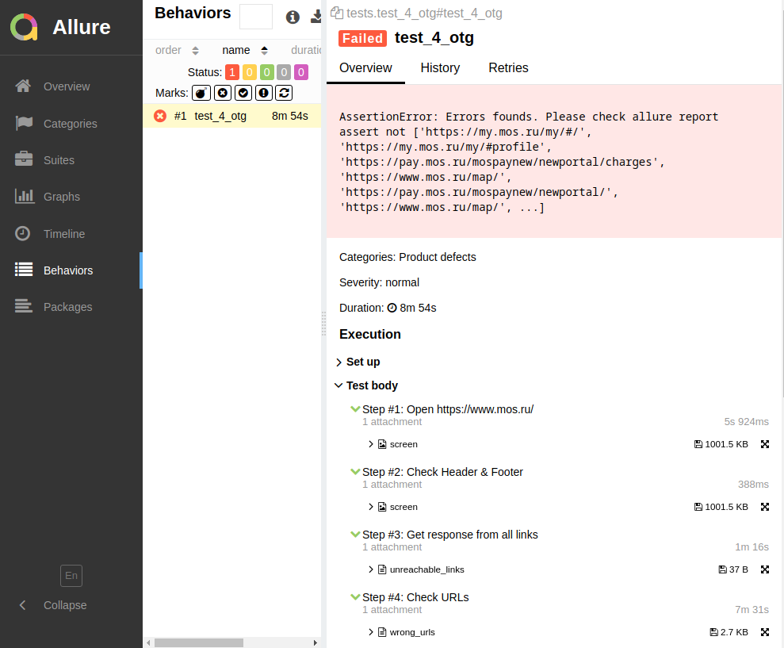

# Решение для [OTP](https://otr.ru/)


Ребята из [OTP](https://otr.ru/) попросили решить задачку, которая сводится к следующим условиям:

```text
Пишем авто-тест на python.
1) Перейти на страницу https://www.mos.ru/
2) Проверить наличие шапки/подвала.
3) Вытащить все ссылки со страницы и проверить их на 200 (280 шт.) 
4) Открыть каждую ссылку и проверить адресную строку браузера, что открывается нужная ссылка
Использовать библиотеки: pytest, allure-pytest, selenium, chromedriver-binary
```
Сказано - сделано. Показываю свое, далекое от идеала, решение. Чтобы его развернуть локально, необходимо: 

1. Установить браузер [Chrome](https://www.google.com/intl/ru_ru/chrome/). Я все тестировал под версией `89`, должно работать и на более новых версиях. 
2. Скачать код данного репозитория:  
`git clone https://github.com/Sam1808/4OTP.git`
3. Python 3.9 или выше в виртуальном окружении. Не забудьте про зависимости:  
`pip install -r requirements.txt`
4. Если хотите красивый Allure отчет то вам нужен `allure-commandline`. Вот, например, [инструкция](https://www.npmjs.com/package/allure-commandline).
Но, в зависимости от операционной системы, возможно надо будет поискать другую.
5. Подготовьте папку для Allure отчета, например `results`.
6. (Опционально) Переименуйте `.env.template` в `.env`. Здесь регулируется TIMEOUT поиска web-элемента.  


Следующий шаг - запуск теста:  
`py.test --alluredir=results ./`, где `results` папка для отчета.   

Т.к. тест один, детализировать его имя не обязательно. Если тестов будет несколько, то нужно будет явно указать конкретное имя теста.

Тест довольно длинный, у меня проходит за ~9 минут.

По окончании теста запустити команду создания отчета:   
`allure serve results`

Команда сгенерирует html-отчет и запустит web-сервер.
Перейдя по ссылке вы увидите примерно вот такой отчет:   


### Лирика

То, что кто то уже дочитал до раздела Лирики - уже подвиг.   
Тест разбит на четыре шага, к каждому шагу прикреплен файл отчета или скриншот.   
К особенностям отнес бы то, что тест не падает на первой сломанной ссылке (например), а проверяет всё
и выдает результат. 
Это удобно, когда о какой-то конкретной ошибке известно, но нужна картина в целом.

Код, построен с использованием *урезанного* паттерна `Page object`, далеко не идеален - но тест всего один,
поэтому не углублялся и не оптимизировал. 

Если тестов много - надо строить масштабируемую систему, хотя даже текущее решение масштабируемое.
Нужно меньше хардкода, больше выводить в переменные, поработать с таймаутами, не забывать про `DRY` и `KISS`.
